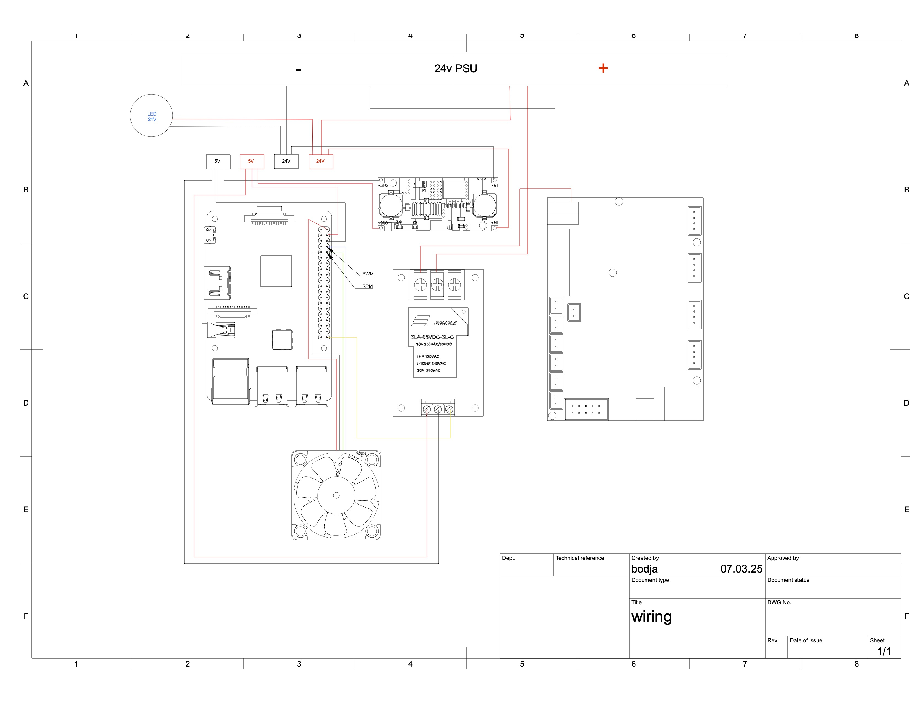

# Ender3 on steroids
(Creality 1.1.5 / tmc2208 UART) with Klipper on Raspberry Pi 3 Model B

**This repo is just a documentation and dump for myself on what I did. An easy way to recall and recover things. And maybe for someone else, who has stepped on same the road of customizing their old Ender.**

- [Klipper](https://github.com/Klipper3d/klipper) (3d-Printer firmware)
- [Moonraker](https://github.com/Arksine/moonraker) (Python 3 based web server. Exposes API of the printer with Klipper firmware which is commonly used by web interfaces like Fluidd and [Mainsail](https://github.com/mainsail-crew/mainsail))
- [Fluidd](https://github.com/fluidd-core/fluidd) (Web interface)

## Installation guide

WARNING: do not run your printer on my printer [config](config/) without reading and understanding it. I have several mods, which wont fit stock setup.

### 1. Install `Raspberry Pi OS Lite` (both 32 and 64 bit will work fine)
Use [raspberry Pi Imager](https://www.raspberrypi.com/software/) for installation.
Before installing, make sure that in settings ssh service is activated and add ssh key. 

### 2. Start installation
```bash
source ./install.sh
```

### 3. Install Klipper firmware to the printer board.
First installation is a bit tricky, but after that it is as easy as described in [Klipper Installation](https://www.klipper3d.org/Installation.html).

#### 3.1 Compile firmware
Open firmware configuration menu, choose `atmega1284p` and save it
```bash
cd ~/klipper/
make menuconfig
```

#### 3.2 Connect Raspberry Pi to the printer board via ICSP headers
Creality 1.1.5 ICSP:
```
 GND  00  RST
MOSI  00  SCK
 VCC  00  MISO
```

Raspberry Pi header map:

Note: mapped with [WiringPi pin numbering scheme](https://pinout.xyz/pinout/wiringpi) and avrdude is configured for `type=linuxgpio`.
Don't get confused with [Raspberry Pi GPIO](https://www.raspberrypi.com/documentation/computers/raspberry-pi.html#gpio):
```
                   00  5V
                   00
                   00
                   00
                   00
                   00
                   00
                   00
(VCC)        3.3v  00  WiringPi5 (MISO)
(MOSI) WiringPi12  00  GND
(RST)  WiringPi13  00  WiringPi6 (SCK)
                   00
                   00
                   00
                   00
                   00
                   00
                   00
                   00
                   00
```
My wiring colors map:
```
VCC  - Red
GND  - Black
MOSI - Yellow
MISO - Orange
SCK  - Green
RST  - Brown
```

Add our GPIO configuration according to connected pins:
```bash
cp /usr/local/etc/avrdude.conf ~/avrdude_gpio.conf
cat << EOF >> ~/avrdude_gpio.conf
programmer
  id = "pi_1";
  desc = "Use the Linux sysfs interface to bitbang GPIO lines";
  type = "linuxgpio";
  reset = 13;
  sck = 6;
  mosi = 12;
  miso = 5;
;
EOF
```
Test connection works:
```bash
sudo avrdude -p atmega1284p -C ~/avrdude_gpio.conf -c pi_1 -v
```
Flash bootloader
```bash
sudo avrdude -p atmega1284p -C ~/avrdude_gpio.conf -c pi_1-b 115200 -e -u -U lock:w:0x3F:m -U efuse:w:0xFD:m -U hfuse:w:0xDE:m -U lfuse:w:0xFF:m
sudo avrdude -p atmega1284p -C ~/avrdude_gpio.conf -c pi_1 -b 115200 -U flash:w:optiboot_atmega1284p.hex
sudo avrdude -p atmega1284p -C ~/avrdude_gpio.conf -c pi_1 -b 115200 -U lock:w:0x0F:m
```
Flash firmware:
```bash
sudo avrdude -p atmega1284p -C ~/avrdude_gpio.conf -c pi_1  -b 115200 -D -U flash:w:klipper/out/klipper.elf.hex:i
```

### Bookmarks
- https://www.klipper3d.org/Bootloaders.html#atmega1284p
- https://github.com/MCUdude/MightyCore

## Full control of drivers including spreadCycle mode

### Notes
- [Setting "spreadCycle" vs "stealthChop" Mode](https://www.klipper3d.org/TMC_Drivers.html#setting-spreadcycle-vs-stealthchop-mode).
It is recommended to always use `spreadCycle` mode (by not specifying `stealthchop_threshold`). Currently, I am running on `stealthChop` mode (by setting `stealthchop_threshold: 999999`).
- [TMC interpolate setting introduces small position deviation](https://www.klipper3d.org/TMC_Drivers.html#tmc-interpolate-setting-introduces-small-position-deviation). For best positional accuracy consider using `spreadCycle` mode and disable interpolation (set `interpolate: False` in the TMC driver config)

### Docs
- [PCB 1.1.2 very similar to 1.1.5](./docs/printer/Ender-3-pcb1.1.2-alsmost-the-same-1.1.5.PCB). Can use [altium.com](https://www.altium.com/viewer/) to open `.pcb` file.
- [tmc2208 datasheet](./docs/tmc2208/TMC2202_TMC2208_TMC2224_datasheet_rev1.14.pdf)
- [1.1.5 board default firmware](./docs/printer/1.1.5-silent-mainboard-8bit-default-firmware.zip)

### Resources
- [Ramps 1.4 and Marlin UART guide](https://www.instructables.com/UART-This-Serial-Control-of-Stepper-Motors-With-th/)
- [tmc2208 how-to YouTube](https://www.youtube.com/watch?v=lNS6_cXNN_o)
- [Klipper-KingRoon-Printers tmc2208 config](https://github.com/nehilo/Klipper-KingRoon-Printers/blob/main/KP5L_Configuration/printer.cfg)

### 1.1.5 Uart mod refs
- https://www.reddit.com/r/ender3/comments/eq7krh/ender_3_113_board_tmc2208_in_uart_mode_with/
- https://simons.tech.blog/2020/01/19/creality-ender-3-v-1-1-3-tmc2208-uart-mod/




## Other refs
- [KAMP](https://github.com/kyleisah/Klipper-Adaptive-Meshing-Purging). I was using it for purging and parking

## Configure slicer (I use PrusaSlicer)
### [[print_stats]](https://www.klipper3d.org/G-Codes.html#print_stats)

Start G-code:
```
{if not is_nil(filament_retract_length[0])}SET_RETRACTION RETRACT_LENGTH={filament_retract_length[0]}{endif}
{if not is_nil(filament_retract_speed[0])}SET_RETRACTION RETRACT_SPEED={filament_retract_speed[0]}{endif}
{if not is_nil(filament_retract_restart_extra[0])}SET_RETRACTION UNRETRACT_EXTRA_LENGTH={filament_retract_restart_extra[0]}{endif}
{if not is_nil(filament_deretract_speed[0])}SET_RETRACTION UNRETRACT_SPEED={filament_deretract_speed[0]}{endif}
START_PRINT BED_TEMP={first_layer_bed_temperature[0]} EXTRUDER_TEMP={first_layer_temperature[0]} TOTAL_LAYER=[total_layer_count]
```
End G-code:
```
END_PRINT
```
After layer change G-code:
```
SET_PRINT_STATS_INFO CURRENT_LAYER={layer_num + 1}
```

## Mods:
- [Enclosure for electronics](https://www.printables.com/model/1199913-ender-3-raspberry-pi-housing)
- [Cooling](https://cults3d.com/en/3d-model/tool/minimus-snap-4010-3-pro-3v2-5-neo-max)
- [Wiring](https://cults3d.com/en/3d-model/tool/armadillo-flex-wire-conduit)
- [PSU relocation](https://www.thingiverse.com/thing:5394166)
- [LGX Lite PRO eXtruder](https://www.bondtech.se/product/lgx-lite-pro-extruder/)
- [Hotend](https://www.bondtech.se/product/copperhead-for-ender-cr-10s-on-ddx-ph2/)
